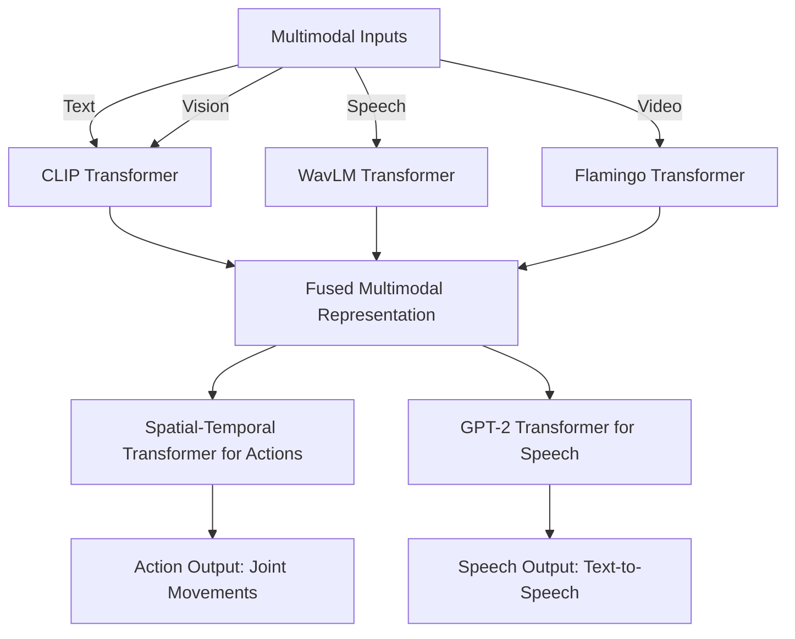
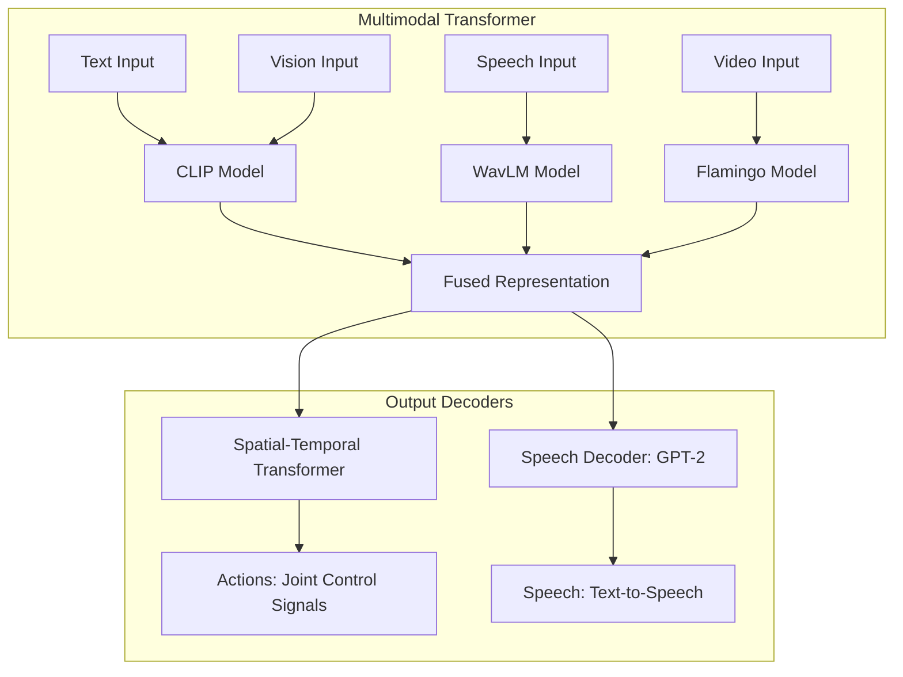

# Primus: The First Transformer-Like Humanoid Robotics Architecture

## Overview

**Primus** is the **first-ever transformer-Like model** for controlling humanoid robots using multimodal inputs such as text, speech, vision, and video. Named after the "first transformer," **Primus** represents the forefront of AI-driven robotics, leveraging cutting-edge transformer models for real-time, coordinated robotic actions and speech generation.

Built for enterprise-grade performance, **Primus** uses state-of-the-art pretrained transformer models like **CLIP**, **WavLM**, **GPT-2**, and **Swin Transformer V2**, enabling seamless fusion of multimodal inputs and robust action generation.

## Key Features

- **Multimodal Inputs**: Integrates text, speech, vision, and video into a unified model using pretrained transformers.
- **Transformer-Based Action Generation**: Uses spatial-temporal transformers to model complex robotic actions over time.
- **Speech Coordination**: Synchronized action and speech generation via cross-attention transformers.
- **Pretrained Models**: Leverages the power of pretrained models like **CLIP**, **Flamingo**, **WavLM**, and **GPT-2**.
- **Enterprise-Grade Scalability**: Built for large-scale robotic applications with real-time performance and fine-tuning capabilities.

## Architecture

The **Primus** architecture consists of multiple transformer-based modules that seamlessly integrate multimodal input processing, spatial-temporal modeling for robotic actions, and synchronized speech generation. Below is a visual representation of the key components.

### High-Level Architecture Diagram (Mermaid)



### Detailed Multimodal Fusion and Action-Speech Diagram



## Key Components

### 1. **Multimodal Transformer**
   - **CLIP**: For vision and text processing.
   - **WavLM**: For speech input processing.
   - **Flamingo**: For handling video inputs.
   - **Fusion Layer**: Combines representations from multiple modalities into a unified latent space.

### 2. **Spatial-Temporal Transformer for Actions**
   - Models dependencies between actions and coordinates complex sequences of joint movements for humanoid robots.

### 3. **GPT-2 for Speech Generation**
   - Handles text generation for speech, capable of producing human-like dialogue synchronized with robotic actions.

## Usage

To run **Primus**, you will need to set up your environment with the required dependencies and have access to pretrained transformer models from **HuggingFace** and **timm**.

### Requirements

- **Python 3.8+**
- **PyTorch 1.10+**
- **Transformers** library by HuggingFace
- **timm** for pretrained vision models

Install dependencies:

```bash
pip install torch transformers timm loguru
```

### Example Usage

```python
import torch
from primus import HumanoidRoboticsModel

# Initialize the Primus model
model = HumanoidRoboticsModel(
    hidden_dim=768,
    num_actions=32,
    vocab_size=10000,
    num_layers=6,
    num_heads=8
)

# Example inputs
text_input = torch.randint(0, 10000, (4, 10))  # Tokenized text
speech_input = torch.randn(4, 16000)           # Raw speech
image_input = torch.randn(4, 3, 224, 224)      # Vision input (224x224 images)
video_input = torch.randn(4, 3, 16, 224, 224)  # Video input (16 frames of 224x224 resolution)

# Forward pass to generate actions and speech
actions, speech_output = model(
    text_input=text_input,
    speech_input=speech_input,
    image_input=image_input,
    video_input=video_input
)

print("Actions: ", actions.shape)
print("Speech Output: ", speech_output.shape)
```


## Full Code
```
import torch
import torch.nn as nn
from loguru import logger
from typing import Tuple, List
from transformers import AutoModel, Wav2Vec2Processor, Wav2Vec2Model
import timm


class PretrainedTextEncoder(nn.Module):
    """Encodes text input using a pretrained HuggingFace Transformer model."""

    def __init__(self, model_name: str = "bert-base-uncased"):
        super(PretrainedTextEncoder, self).__init__()
        self.model = AutoModel.from_pretrained(model_name)
        self.hidden_dim = self.model.config.hidden_size

    def forward(self, text_input: torch.Tensor) -> torch.Tensor:
        """Encodes text input into latent representation.

        Args:
            text_input (torch.Tensor): Tensor of tokenized text input.

        Returns:
            torch.Tensor: Latent text representation.
        """
        outputs = self.model(text_input).last_hidden_state
        logger.info(f"Text input encoded with shape: {outputs.shape}")
        return outputs


class PretrainedSpeechEncoder(nn.Module):
    """Encodes speech input using HuggingFace Wav2Vec2."""

    def __init__(self, model_name: str = "facebook/wav2vec2-base-960h"):
        super(PretrainedSpeechEncoder, self).__init__()
        self.processor = Wav2Vec2Processor.from_pretrained(model_name)
        self.model = Wav2Vec2Model.from_pretrained(model_name)
        self.hidden_dim = self.model.config.hidden_size

    def forward(self, speech_input: torch.Tensor) -> torch.Tensor:
        """Encodes speech input into latent representation.

        Args:
            speech_input (torch.Tensor): Tensor of raw speech input.

        Returns:
            torch.Tensor: Latent speech representation.
        """
        outputs = self.model(speech_input).last_hidden_state
        logger.info(f"Speech input encoded with shape: {outputs.shape}")
        return outputs


class PretrainedImageEncoder(nn.Module):
    """Encodes image input using the best model from timm (Swin Transformer V2)."""

    def __init__(self, model_name: str = "swinv2_base_window12_192_22k"):
        super(PretrainedImageEncoder, self).__init__()
        # Load the best vision model from timm
        self.model = timm.create_model(
            model_name, pretrained=True, num_classes=0
        )  # Remove classification head
        self.hidden_dim = (
            self.model.num_features
        )  # Hidden dimension of the model output

    def forward(self, image_input: torch.Tensor) -> torch.Tensor:
        """Encodes image input into latent representation.

        Args:
            image_input (torch.Tensor): Tensor of images.

        Returns:
            torch.Tensor: Latent image representation.
        """
        outputs = self.model(image_input)  # Pass through Swin Transformer V2
        logger.info(f"Image input encoded with shape: {outputs.shape}")
        return outputs


class PretrainedVideoEncoder(nn.Module):
    """Encodes video input using a pretrained timm model (for images) by averaging video frames."""

    def __init__(self, model_name: str = "vit_base_patch16_224"):
        super(PretrainedVideoEncoder, self).__init__()
        self.model = timm.create_model(
            model_name, pretrained=True, num_classes=0
        )  # No classification head
        self.hidden_dim = self.model.num_features

    def forward(self, video_input: torch.Tensor) -> torch.Tensor:
        """Encodes video input by averaging frames and then using the timm model.

        Args:
            video_input (torch.Tensor): Tensor of video frames (Batch, Channels, Frames, Height, Width).

        Returns:
            torch.Tensor: Latent video representation.
        """
        # Average over the frames dimension (dim=2), resulting in (Batch, Channels, Height, Width)
        video_input = video_input.mean(dim=2)

        # Pass the averaged frame through the model (now in 4D format)
        outputs = self.model(video_input)

        logger.info(f"Video input encoded with shape: {outputs.shape}")
        return outputs


class MultimodalFusion(nn.Module):
    """Multimodal fusion network that combines text, speech, vision, and video representations."""

    def __init__(self, input_dim: int = 4352, hidden_dim: int = None):
        super(MultimodalFusion, self).__init__()
        # Updated the input size to match the total concatenated dimension (4352)
        self.fc = nn.Linear(
            input_dim, hidden_dim
        )  # 768 (text) + 768 (speech) + 2048 (image) + 768 (video)

    def forward(self, encodings: List[torch.Tensor]) -> torch.Tensor:
        """Fuses multiple input modalities.

        Args:
            encodings (List[torch.Tensor]): List of encoded modalities (text, speech, image, video).

        Returns:
            torch.Tensor: Fused multimodal representation.
        """
        concatenated = torch.cat(
            encodings, dim=1
        )  # Concatenate along the feature dimension
        fused_representation = self.fc(concatenated)
        logger.info(f"Fused representation shape: {fused_representation.shape}")
        return fused_representation


class ActionDecoder(nn.Module):
    """Decodes fused multimodal representations into a sequence of actions using a transformer."""
    def __init__(self, hidden_dim: int, num_actions: int = 64, num_layers: int = 6, num_heads: int = 32):
        super(ActionDecoder, self).__init__()
        self.transformer = nn.TransformerEncoder(
            nn.TransformerEncoderLayer(
                d_model=hidden_dim, 
                nhead=num_heads
            ), 
            num_layers=num_layers
        )
        self.fc = nn.Linear(hidden_dim, num_actions)  # Final linear layer to produce action outputs
    
    def forward(self, fused_representation: torch.Tensor) -> torch.Tensor:
        """Generates control signals (actions) for the humanoid robot using a transformer.
        
        Args:
            fused_representation (torch.Tensor): Fused multimodal latent vector.
        
        Returns:
            torch.Tensor: Control actions for the humanoid robot.
        """
        # Unsqueeze the fused representation to add a sequence dimension (batch_size, seq_len=1, hidden_dim)
        fused_representation = fused_representation.unsqueeze(1)
        
        # Pass through the transformer to generate action sequences
        transformer_output = self.transformer(fused_representation)
        
        # Flatten the output and pass through the fully connected layer to get the final actions
        actions = self.fc(transformer_output.squeeze(1))
        logger.info(f"Generated actions shape: {actions.shape}")
        return actions


class SpeechDecoder(nn.Module):
    """Decodes fused multimodal representations into speech (e.g., text-to-speech)."""

    def __init__(self, hidden_dim: int, vocab_size: int):
        super(SpeechDecoder, self).__init__()
        self.fc = nn.Linear(hidden_dim, vocab_size)

    def forward(self, fused_representation: torch.Tensor) -> torch.Tensor:
        """Generates speech output.

        Args:
            fused_representation (torch.Tensor): Fused multimodal latent vector.

        Returns:
            torch.Tensor: Generated speech (text output).
        """
        speech_output = self.fc(fused_representation)
        logger.info(f"Generated speech output shape: {speech_output.shape}")
        return speech_output


class HumanoidMultimodalModel(nn.Module):
    """Multimodal Foundation Model for humanoid robotics."""

    def __init__(self, hidden_dim: int, num_actions: int, vocab_size: int):
        super(HumanoidMultimodalModel, self).__init__()
        self.hidden_dim = hidden_dim
        # Pretrained Encoders for each modality
        self.text_encoder = PretrainedTextEncoder()
        self.speech_encoder = PretrainedSpeechEncoder()
        self.image_encoder = PretrainedImageEncoder()
        self.video_encoder = PretrainedVideoEncoder()

        # Decoders
        self.action_decoder = ActionDecoder(hidden_dim, num_actions)
        self.speech_decoder = SpeechDecoder(hidden_dim, vocab_size)

    def forward(
        self,
        text_input: torch.Tensor,
        speech_input: torch.Tensor,
        image_input: torch.Tensor,
        video_input: torch.Tensor,
    ) -> Tuple[torch.Tensor, torch.Tensor]:
        """Forward pass for the multimodal humanoid model.

        Args:
            text_input (torch.Tensor): Textual input (tokenized).
            speech_input (torch.Tensor): Speech input (raw audio).
            image_input (torch.Tensor): Image input.
            video_input (torch.Tensor): Video input.

        Returns:
            Tuple[torch.Tensor, torch.Tensor]: Output actions for the robot and speech (text) output.
        """
        # Encode each modality
        text_encoding = self.text_encoder(
            text_input
        )  # Shape: [batch_size, seq_length, hidden_dim]
        speech_encoding = self.speech_encoder(
            speech_input
        )  # Shape: [batch_size, seq_length, hidden_dim]
        image_encoding = self.image_encoder(
            image_input
        )  # Shape: [batch_size, hidden_dim]
        video_encoding = self.video_encoder(
            video_input
        )  # Shape: [batch_size, hidden_dim]

        # Apply mean pooling to text and speech to reduce to [batch_size, hidden_dim]
        text_encoding = text_encoding.mean(dim=1)
        speech_encoding = speech_encoding.mean(dim=1)

        _, d_t = text_encoding.shape
        _, d_s = speech_encoding.shape
        _, d_i = image_encoding.shape
        _, d_v = video_encoding.shape

        # Fuse modalities
        # fused_representation = self.fusion([text_encoding, speech_encoding, image_encoding, video_encoding])
        logger.info(f"Input dim{d_t + d_s + d_i + d_v}")
        fused_representation = MultimodalFusion(
            d_t + d_s + d_i + d_v, self.hidden_dim
        )([text_encoding, speech_encoding, image_encoding, video_encoding])

        # Decode into actions and speech
        actions = self.action_decoder(fused_representation)
        speech_output = self.speech_decoder(fused_representation)

        return actions, speech_output


if __name__ == "__main__":
    # Example input sizes (to be adjusted based on real data)
    batch_size = 4
    hidden_dim = 768
    num_actions = 32  # Example: 32 controllable joints
    vocab_size = 10000  # Example: 10k word vocab for speech

    # Initialize the model
    model = HumanoidMultimodalModel(hidden_dim, num_actions, vocab_size)

    # Sample inputs (random tensors as placeholders)
    text_input = torch.randint(
        0, vocab_size, (batch_size, 10)
    )  # Tokenized text input
    speech_input = torch.randn(batch_size, 16000)  # Example raw audio input
    image_input = torch.randn(
        batch_size, 3, 192, 192
    )  # Image input (224x224 resolution)
    video_input = torch.randn(
        batch_size, 3, 16, 224, 224
    )  # Video input (16 frames, 224x224 resolution)

    # Forward pass
    actions, speech_output = model(
        text_input, speech_input, image_input, video_input
    )
    logger.info(
        f"Actions: {actions.shape}, Speech Output: {speech_output.shape}"
    )


```

## Training & Fine-Tuning

### Pretrained Models
**Primus** leverages multiple pretrained models, including:
- **CLIP** (for text-image processing)
- **WavLM** (for speech)
- **Swin Transformer V2** (for vision)
- **GPT-2** (for speech generation)

You can further fine-tune the model on specific tasks or domains using standard backpropagation and gradient descent methods in PyTorch.

### Custom Training with Reinforcement Learning
Primus can also be fine-tuned using reinforcement learning algorithms like **PPO** or **SAC**, allowing it to optimize robotic actions based on feedback from a simulated environment.

## Contributing

We welcome contributions from the community. If you'd like to contribute to **Primus**, please follow our [contributing guidelines](CONTRIBUTING.md) and submit a pull request.

## License

Primus is licensed under the MIT License. See [LICENSE](LICENSE) for more details.

## Acknowledgements

This project makes use of several open-source projects and pretrained models, including:
- **Transformers** by HuggingFace
- **timm** by Ross Wightman
- **Differentiable Physics Engines** like Brax and MuJoCo for simulation

---

### Future Work

- **Reinforcement Learning Integration**: Full support for training with real-time feedback using differentiable physics engines.
- **Memory Augmentation**: Adding hierarchical memory modules for long-term task execution.
- **Self-Supervised Learning**: Adding self-supervised objectives to enhance model performance.

For enterprise inquiries, please contact **enterprise@primusrobotics.com**.
