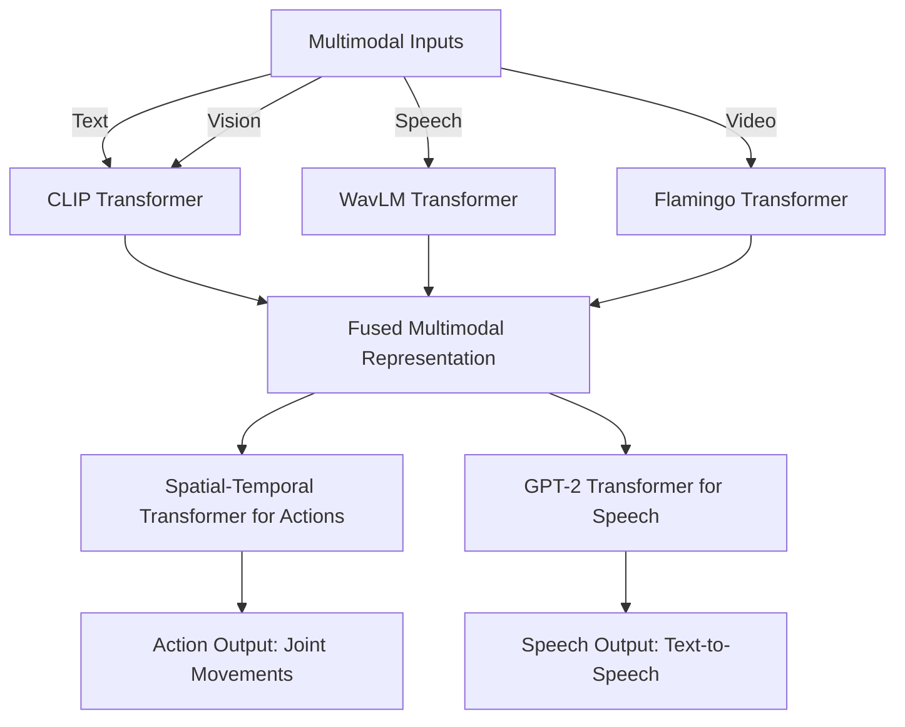
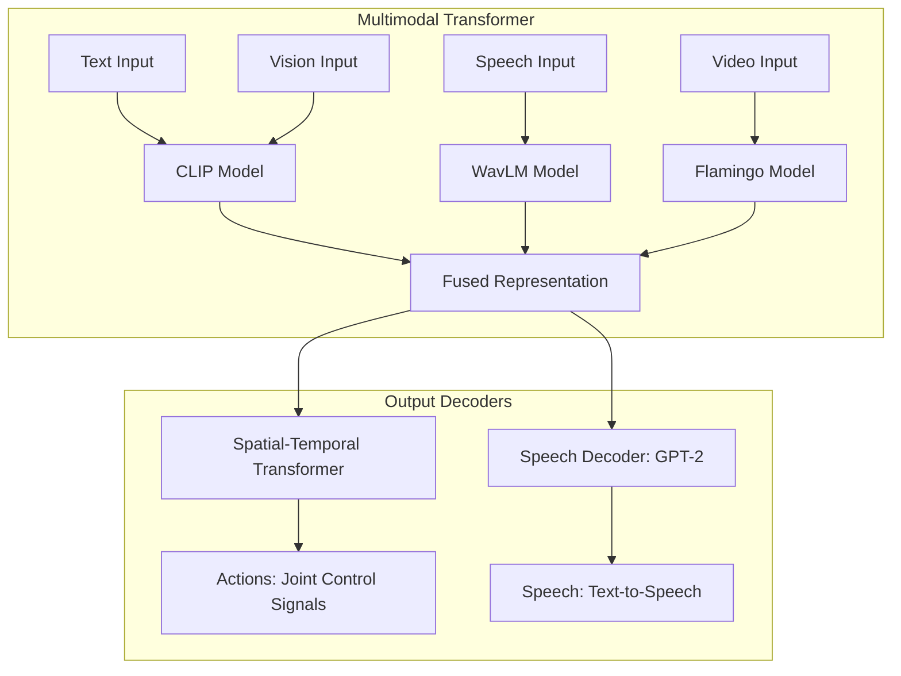

# Primus: The First Transformer-Like Humanoid Robotics Architecture

## Overview

**Primus** is the **first-ever transformer-Like model** for controlling humanoid robots using multimodal inputs such as text, speech, vision, and video. Named after the "first transformer," **Primus** represents the forefront of AI-driven robotics, leveraging cutting-edge transformer models for real-time, coordinated robotic actions and speech generation.

Built for enterprise-grade performance, **Primus** uses state-of-the-art pretrained transformer models like **CLIP**, **WavLM**, **GPT-2**, and **Swin Transformer V2**, enabling seamless fusion of multimodal inputs and robust action generation.

## Key Features

- **Multimodal Inputs**: Integrates text, speech, vision, and video into a unified model using pretrained transformers.
- **Transformer-Based Action Generation**: Uses spatial-temporal transformers to model complex robotic actions over time.
- **Speech Coordination**: Synchronized action and speech generation via cross-attention transformers.
- **Pretrained Models**: Leverages the power of pretrained models like **CLIP**, **Flamingo**, **WavLM**, and **GPT-2**.
- **Enterprise-Grade Scalability**: Built for large-scale robotic applications with real-time performance and fine-tuning capabilities.

## Architecture

The **Primus** architecture consists of multiple transformer-based modules that seamlessly integrate multimodal input processing, spatial-temporal modeling for robotic actions, and synchronized speech generation. Below is a visual representation of the key components.

### High-Level Architecture Diagram (Mermaid)



### Detailed Multimodal Fusion and Action-Speech Diagram



## Key Components

### 1. **Multimodal Transformer**
   - **CLIP**: For vision and text processing.
   - **WavLM**: For speech input processing.
   - **Flamingo**: For handling video inputs.
   - **Fusion Layer**: Combines representations from multiple modalities into a unified latent space.

### 2. **Spatial-Temporal Transformer for Actions**
   - Models dependencies between actions and coordinates complex sequences of joint movements for humanoid robots.

### 3. **GPT-2 for Speech Generation**
   - Handles text generation for speech, capable of producing human-like dialogue synchronized with robotic actions.

## Usage

To run **Primus**, you will need to set up your environment with the required dependencies and have access to pretrained transformer models from **HuggingFace** and **timm**.

### Requirements

- **Python 3.8+**
- **PyTorch 1.10+**
- **Transformers** library by HuggingFace
- **timm** for pretrained vision models

Install dependencies:

```bash
pip install torch transformers timm loguru
```

### Example Usage

```python
import torch
from primus import HumanoidRoboticsModel

# Initialize the Primus model
model = HumanoidRoboticsModel(
    hidden_dim=768,
    num_actions=32,
    vocab_size=10000,
    num_layers=6,
    num_heads=8
)

# Example inputs
text_input = torch.randint(0, 10000, (4, 10))  # Tokenized text
speech_input = torch.randn(4, 16000)           # Raw speech
image_input = torch.randn(4, 3, 224, 224)      # Vision input (224x224 images)
video_input = torch.randn(4, 3, 16, 224, 224)  # Video input (16 frames of 224x224 resolution)

# Forward pass to generate actions and speech
actions, speech_output = model(
    text_input=text_input,
    speech_input=speech_input,
    image_input=image_input,
    video_input=video_input
)

print("Actions: ", actions.shape)
print("Speech Output: ", speech_output.shape)
```

## Training & Fine-Tuning

### Pretrained Models
**Primus** leverages multiple pretrained models, including:
- **CLIP** (for text-image processing)
- **WavLM** (for speech)
- **Swin Transformer V2** (for vision)
- **GPT-2** (for speech generation)

You can further fine-tune the model on specific tasks or domains using standard backpropagation and gradient descent methods in PyTorch.

### Custom Training with Reinforcement Learning
Primus can also be fine-tuned using reinforcement learning algorithms like **PPO** or **SAC**, allowing it to optimize robotic actions based on feedback from a simulated environment.

## Contributing

We welcome contributions from the community. If you'd like to contribute to **Primus**, please follow our [contributing guidelines](CONTRIBUTING.md) and submit a pull request.

## License

Primus is licensed under the MIT License. See [LICENSE](LICENSE) for more details.

## Acknowledgements

This project makes use of several open-source projects and pretrained models, including:
- **Transformers** by HuggingFace
- **timm** by Ross Wightman
- **Differentiable Physics Engines** like Brax and MuJoCo for simulation

---

### Future Work

- **Reinforcement Learning Integration**: Full support for training with real-time feedback using differentiable physics engines.
- **Memory Augmentation**: Adding hierarchical memory modules for long-term task execution.
- **Self-Supervised Learning**: Adding self-supervised objectives to enhance model performance.

For enterprise inquiries, please contact **enterprise@primusrobotics.com**.
